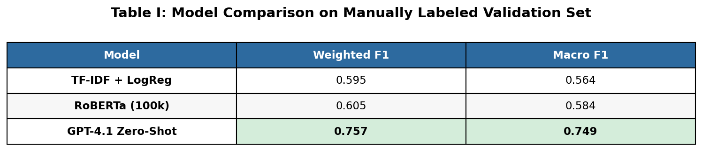
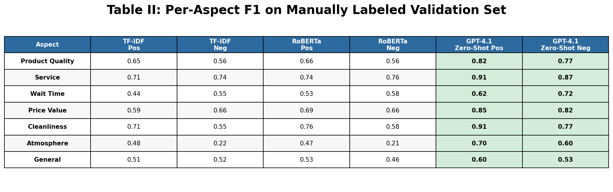

# Aspect-Based Sentiment Analysis of Google Maps Reviews

[Paper](docs/paper.pdf)

Compares traditional NLP (TF-IDF), transformer-based (RoBERTa), and generative LLM (GPT-4.1-mini) approaches for extracting aspect-sentiment pairs from large-scale customer reviews. Labels are generated via weak supervision using star ratings, then validated against a manually labeled holdout set of 2,508 reviews.

---

## Goal
Evaluate how well classical and modern NLP methods can identify aspect-level sentiment from real-world review data at scale. The pipeline covers data processing, exploratory analysis, weak supervision label generation, and model training across three approaches — TF-IDF + Logistic Regression, RoBERTa fine-tuning, and LLM prompting (zero-shot and few-shot) — benchmarked against a manually labeled ABSA validation set.

---

## Results

### Weakly Labeled Test Set
| Model | Weighted F1 | Macro F1 | Accuracy |
|-------|-------------|----------|----------|
| RoBERTa Fine-Tuned (100K) | 0.928 | 0.876 | 0.909 |
| TF-IDF + Logistic Regression | 0.882 | 0.785 | 0.783 |

### Manually Labeled Validation Set (Ground Truth)
| Model | Weighted F1 | Macro F1 |
|-------|-------------|----------|
| GPT-4.1-mini Zero-Shot | 0.757 | 0.749 |
| GPT-4.1-mini Few-Shot | 0.738 | 0.729 |
| RoBERTa Fine-Tuned (100K) | 0.605 | 0.584 |
| TF-IDF + Logistic Regression | 0.595 | 0.564 |

The gap between test and validation performance reflects the noise inherent in weak supervision — models trained on star-rating proxy labels learn patterns that don't fully transfer to true human annotations. GPT-4.1-mini zero-shot, requiring no training data, achieves the strongest performance on the ground truth validation set.




---

## Highlights
- Weak supervision pipeline scales to 22M reviews using star ratings as proxy labels
- RoBERTa outperforms TF-IDF by ~9 points Macro F1 on the weakly labeled test set
- Scaling experiments (10K–250K) show diminishing returns beyond 100K training samples
- GPT-4.1-mini zero-shot outperforms both trained models on the manually labeled validation set
- Few-shot prompting underperformed zero-shot, suggesting the examples introduced unwanted bias
- Atmosphere is the hardest aspect across all models — semantic breadth limits detection regardless of architecture

---

## Built With
- Python (Pandas, NumPy, Matplotlib, Seaborn, Scikit-Learn)
- Transformers (HuggingFace RoBERTa)
- OpenAI API (GPT-4.1-mini)
- Jupyter Notebooks
- Google Local Reviews dataset (UC San Diego McAuley Lab)

---

## Labels

**7 aspects × 2 sentiments = 14 binary labels**

Aspects: `product_quality`, `service`, `wait_time`, `price_value`, `cleanliness`, `atmosphere`, `general`

Sentiments: `positive`, `negative`

---

## Figures

| Figure | Description |
|--------|-------------|
| `figure1_tfidf_comparison.png` | TF-IDF model configurations compared across Weighted F1, Macro F1, accuracy, and aspect F1 by sentiment |
| `figure2_tfidf_confusion.png` | Confusion matrices for best, average, and worst performing TF-IDF classes |
| `figure3_tfidf_aspect_f1.png` | TF-IDF aspect F1 by sentiment on validation set |
| `figure4_atmosphere_features.png` | Top TF-IDF features driving atmosphere negative predictions |
| `figure5_roberta_scaling.png` | RoBERTa scaling results across 10K–250K samples with training time |
| `figure6_roberta_confusion.png` | Confusion matrices for best, average, and worst performing RoBERTa classes |
| `figure7_roberta_aspect_f1.png` | RoBERTa aspect F1 by sentiment on validation set |
| `table1_model_comparison.png` | Overall model comparison on manually labeled validation set |
| `table2_aspect_comparison.png` | Per-aspect F1 comparison across all models on manually labeled validation set |

---

## File Structure
```
google_review_insights/
├── figures/
│   ├── figure1_tfidf_comparison.png
│   ├── figure2_tfidf_confusion.png
│   ├── figure3_tfidf_aspect_f1.png
│   ├── figure4_atmosphere_features.png
│   ├── figure5_roberta_scaling.png
│   ├── figure6_roberta_confusion.png
│   ├── figure7_roberta_aspect_f1.png
│   ├── table1_model_comparison.png
│   └── table2_aspect_comparison.png
├── data/                                # Large files stored on UCSD DSMLP
│   └── .gitkeep
├── notebooks/
│   ├── 01_process_data.ipynb            # Data cleaning and preprocessing
│   ├── 02_eda.ipynb                     # Exploratory data analysis
│   ├── 03_feature_engineering.ipynb     # Feature extraction and engineering
│   ├── 04_absa_training_set.ipynb       # Manual labeling widget and annotation
│   ├── 05a_model_tfidf.ipynb            # TF-IDF + LogReg class weighting experiments (full 22M rows)
│   ├── 05b_model_tfidf_eval.ipynb       # TF-IDF evaluation
│   ├── 06a_model_roberta.ipynb          # RoBERTa scaling experiments (10K–250K)
│   ├── 06b_model_roberta_eval.ipynb     # RoBERTa evaluation
│   ├── 07a_model_llm_prompt_ws.ipynb    # GPT-4.1-mini on weakly labeled data
│   ├── 07b_model_llm_prompt_man.ipynb   # GPT-4.1-mini on manually labeled data
│   └── 08_tables.ipynb                  # Final comparison tables
├── models/
│   ├── tfidf_vectorizer.pkl             # TF-IDF vectorizer (on DSMLP)
│   ├── tfidf_logreg_final.pkl           # Best TF-IDF LogReg model (3x penalty)
│   └── roberta_final/                   # Fine-tuned RoBERTa model (on DSMLP)
├── docs/
│   ├── paper.pdf                        # Research paper
│   └── presentation.pdf                 # Presentation slides
├── .gitignore
└── README.md
```

---

## Data Setup

**Google Local Data (2021) — UC San Diego McAuley Lab**

Raw data (~25GB) is not stored due to size constraints. Processed files are available on UCSD DSMLP.

To download the raw data:
[Google Local Data (2021)](https://mcauleylab.ucsd.edu/public_datasets/gdrive/googlelocal/)

---

## Citations

Li, J., Shang, J., & McAuley, J. (2022). UCTopic: Unsupervised Contrastive Learning for Phrase Representations and Topic Mining. *ACL.*

Yan, A., He, Z., Li, J., Zhang, T., & McAuley, J. (2023). Personalized Showcases: Generating Multi-Modal Explanations for Recommendations. *SIGIR.*

---

## Contributors
Zack M. • Jillian O.
